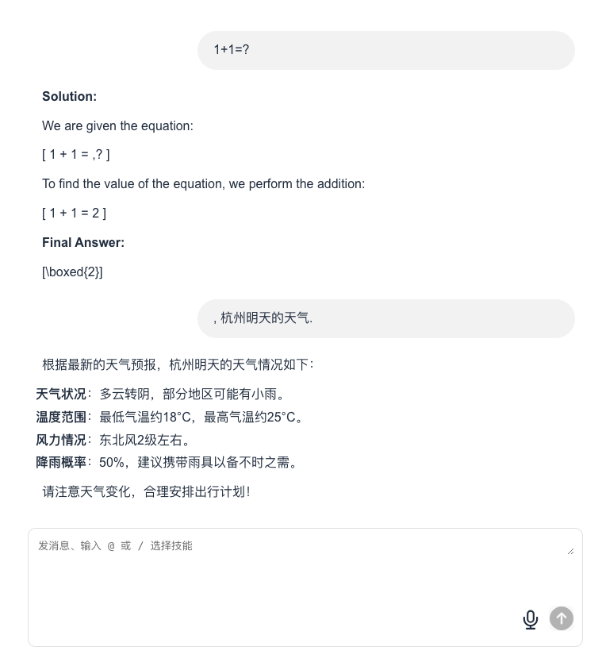

# GPT - 语音与文本 AI 助手

本项目是一个基于 GPT 的 AI 助手，支持 **文本输入输出** 和 **语音输入**，提供流畅的 AI 交互体验。

## ✨ 功能特点

- **文本与语音交互**，输入方式更灵活
- **基于 deepseek-r1-distill-qwen-32b**
- **支持自定义模型**，可自由切换推理服务
- **简洁直观的 UI 界面**



---

## 🚀 快速启动

### **1️⃣ 环境要求**

请确保你的本地环境符合以下条件：

- **Node.js >= 18**（使用 `node -v` 检查版本）
- **NPM / PNPM / Yarn**（推荐使用 `npm`）

---

### **2️⃣ 安装依赖**

在项目根目录运行：

```bash
npm install
```

### **3️⃣ 启动后端服务**

```bash
npm run server
```

后端服务启动后，将自动提供 API 接口。

### **4️⃣ 启动前端**

```bash
npm run dev
```

前端启动成功后，你将看到访问地址。

### **5️⃣ 访问页面**

在浏览器中打开：

```arduino
http://localhost:5173/
```
